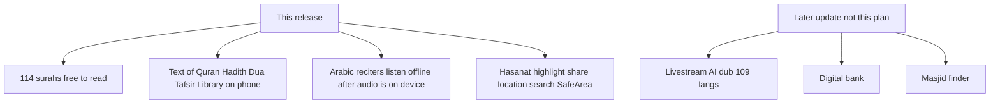

# What the client actually asked

Not "how the code is." From Ilone's chats + the **Final Technical Master Blueprint**.

Ilone's test failures (must not happen again):
- No internet → Quran did not load. His **Google Ads / promo video** says Offline Quran. The app must match that video, or the marketing is false. This is not an in-app ad.
- Surah Baqarah locked behind premium. Quran must be free.
- Library empty / too short. Must be IslamHouse, offline, in every app language.
- Almost no Hadith. Tafsir/Hadith must work offline.
- Recitation only with internet. Same rule: promo video says Offline Quran Audio — listen must work with no net after audio is on the phone.
- Prayer stuck on Bangladesh; he lives in Vienna.
- Search "Guidance" = no results.
- Highlight tap opens surah start, not the marked ayah.
- Share ayah does nothing.
- Hasanat counts only once per surah; he wants every read/recite, no limit.
- Samsung bar covers buttons.
- Koran / Milchschwestern / konyv spelling.

---

## This release (client NOW)

**Quran**
- All 114 surahs free. No paywall. No lock on Al-Baqarah.
- Full text + translation in local DB so airplane mode still reads.
- 12–16 reciters from quran.com. App language does not change the voice: **always original Arabic**.
- Offline listen must match the promo video line Offline Quran Audio. Audio on the phone after download/cache of the chosen reciter. Not stream-only.

**Knowledge Library — 3 sections, on the phone**
- Articles (400+), Books (169, own section), Fatwas (30–39).
- Rich text in the app. Offline. Every app language, not only DE/EN/TR.
- Bookmarks, highlight colors, reading progress like Quran.

**Hadith + Tafsir + Dua**
- Enough Hadith (not a handful). Tafsir and Hadith readable offline like Quran.

**Sheikh (5): Abu Alia, Abul Baraa, Pierre Vogel, One Message Foundation, Alim Hamza**
- Two tabs: Video lectures, Audio Hörreisen.
- In-app YouTube player. **Live stream needs internet** (blueprint). Full channels, not a few videos.

**Prayer**
- GPS + manual city search. Default not Bangladesh. Vienna must be selectable. Qibla compass.

**Supporter (Stripe)**
- Monthly from €4.99 (drop €0.79 / €1.99). Annual €34.99 / €44.99 / €55.99. Optional €100 lifetime.
- 30-day trial on sub plans, not on €100.
- 14 benefit lines from **API**, not hardcoded. Quran **text** stays free even if the promo list names Tafsir/Hadith/Library as supporter extras.

**Bugs Ilone filed**
- Hasanat: add points every time the surah is read or recited. Remove the once-only lock.
- Highlights: jump to that ayah, not surah 1 / start.
- Share: ayah text + `quraninternational://surah/{n}/ayah/{n}`.
- Search: real hits (Guidance etc.).
- SafeArea above Samsung nav.
- Spelling: Quran, Milchschwester, könyv.

---

## How we make offline true (logic)

Phone is the library after **one** successful online fill (and again when language changes).

- Backend dump must actually fill: ingest if empty, page in Mongo, JSON the app can save, ayahs keyed by edition.
- App then writes SQLite and **only reads SQLite** on those screens.
- No net / 401 / logout: keep DB, keep reading.

That is why dump gets **fixed**, not ignored. Client asked for offline; current dump cannot deliver it.

---

## Not this release (Ilone parked or "later update")

- Digital bank / APK-only untraceable payments
- 109-language AI livestream dub
- Masjid finder as YouTube+Twitch
- Gold Club 100 seats (he also considered dropping it)
- Affiliate 40–50%
- Bundling 16 full reciter libraries into the APK as one huge binary (he asked; we still put audio **on device via download/cache**, not a 2GB store listing)
- YouTube-policy "download 10,000 channel videos as one button" — he wants it; stream+optional user download is the honest now; bulk YouTube rip is not this sprint

---

## Done when (promo video is not a lie)

Ilone paid for a **Google Ads promotional video**. That video / copy says Offline Quran (and Offline Quran Audio). He asked: can I send this text to the video producer? Only if the **app behaves the same**.

Not an in-app advertisement. No UI work named "Offline Quran ad."

After one successful online open, his test:

1. Airplane mode.
2. Kill and reopen the app.
3. Open Al-Baqarah and other surahs — **text is there**.
4. Play a reciter already saved on the phone — **sound plays**.

If step 3 fails, he cannot use that promo video. Product must match marketing.

Promo can stay: read Quran offline; listen after reciter audio is on the phone; library/Hadith/Tafsir read offline after first sync.

Promo must not imply: first install never online still has Quran; Sheikh YouTube with no net unless that file was saved.
